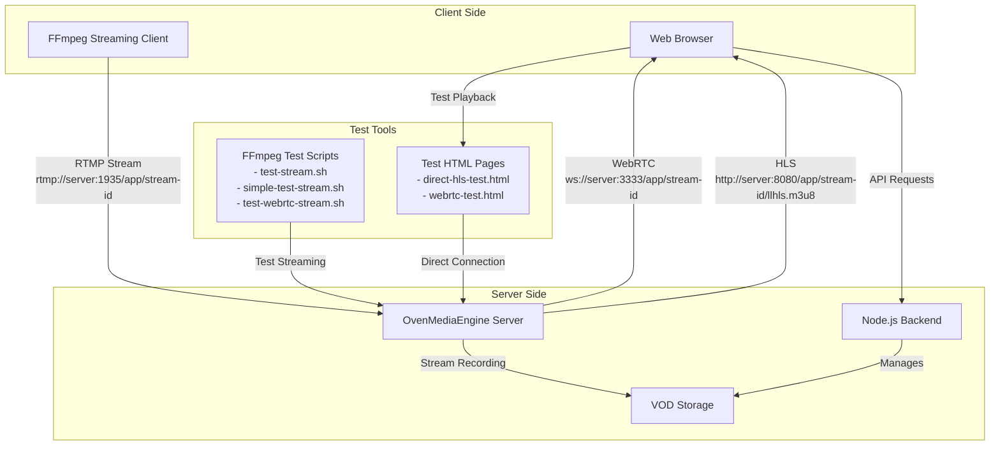

# Low-Latency Live Streaming System with OvenMediaEngine

A production-grade live streaming system built with OvenMediaEngine (OME) that supports ultra-low latency streaming via WebRTC and LL-HLS.

## Features

- **Multi-protocol Support**:

  - WebRTC for ultra-low latency (<1s)
  - LL-HLS for CDN-compatible low latency (2-5s)
  - Automatic protocol fallback

- **Adaptive Bitrate Streaming**:

  - 1080p @ 4.5 Mbps
  - 720p @ 2.5 Mbps
  - 480p @ 1.2 Mbps
  - 360p @ 600 kbps

- **Authentication & Security**:

  - JWT-based token authentication
  - Stream publishing validation
  - Playback access control

- **VOD Capabilities**:

  - Automatic recording of live streams
  - Cloud storage (GCS) upload for VOD playback
  - HLS-based playback of archived streams

- **Scalability**:
  - Kubernetes-ready deployment
  - SFU-mode for WebRTC scalability
  - Horizontal scaling capability

## Architecture

The system consists of the following components:

1. **OvenMediaEngine (OME)**:

   - Handles ingest, transcoding, and delivery
   - Supports RTMP, WebRTC, and LL-HLS

2. **Backend API**:

   - Node.js/Express server
   - Stream management and token generation
   - Webhook handlers for stream events

3. **VOD Uploader**:

   - Processes recorded streams
   - Uploads to Google Cloud Storage
   - Updates VOD status in the database

4. **Frontend**:
   - React-based web UI
   - OvenPlayer for playback
   - Automatic protocol selection and fallback

## Architecture Diagram



## Setup and Deployment

### Prerequisites

- Docker and Docker Compose (for local development)
- Kubernetes cluster (for production)
- Google Cloud Storage account (for VOD)

### Local Development

1. Clone the repository:

   ```bash
   git clone https://github.com/yourusername/live-streaming-system.git
   cd live-streaming-system
   ```

2. Create a `.env` file with the required environment variables:

   ```
   JWT_SECRET=your_jwt_secret_key
   STORAGE_BUCKET=your_gcs_bucket
   ```

3. Start the services using Docker Compose:

   ```bash
   docker-compose up -d
   ```

4. Access the services:
   - Frontend: http://localhost
   - API: http://localhost/api
   - RTMP Ingest: rtmp://localhost:1935/live

### Production Deployment

1. Build and push Docker images:

   ```bash
   docker build -f docker/ome.Dockerfile -t your-registry/ome:latest .
   docker build -f docker/backend.Dockerfile -t your-registry/backend:latest .
   docker build -f docker/frontend.Dockerfile -t your-registry/frontend:latest .

   docker push your-registry/ome:latest
   docker push your-registry/backend:latest
   docker push your-registry/frontend:latest
   ```

2. Update Kubernetes manifest files:

   - Update image references in the deployment files
   - Set up secrets for JWT tokens and GCS credentials
   - Configure domain names in the ingress

3. Apply Kubernetes manifests:
   ```bash
   kubectl apply -f k8s/manifests/namespace.yaml
   kubectl apply -f k8s/manifests/ome-deployment.yaml
   kubectl apply -f k8s/manifests/backend-deployment.yaml
   kubectl apply -f k8s/manifests/frontend-deployment.yaml
   kubectl apply -f k8s/manifests/ingress.yaml
   ```

## Usage

### Creating a Stream

1. Call the API to create a new stream:

   ```bash
   curl -X POST -H "Content-Type: application/json" -H "Authorization: Bearer YOUR_TOKEN" \
     -d '{"name":"My Live Stream","description":"Test stream","isPrivate":false}' \
     http://localhost/api/streams
   ```

2. Get the stream key:

   ```bash
   curl -H "Authorization: Bearer YOUR_TOKEN" http://localhost/api/streams/YOUR_STREAM_ID/key
   ```

3. Configure OBS Studio:
   - URL: `rtmp://your-domain/live/YOUR_STREAM_ID`
   - Stream Key: `YOUR_STREAM_KEY`

### Playback

1. Get playback URLs:

   ```bash
   curl http://localhost/api/streams/YOUR_STREAM_ID/playback
   ```

2. Play using the provided URLs:
   - WebRTC: `webrtc://your-domain/live/YOUR_STREAM_ID`
   - LL-HLS: `https://your-domain/live/YOUR_STREAM_ID/llhls.m3u8`

## License

This project is licensed under the MIT License - see the LICENSE file for details.

## Acknowledgements

- [OvenMediaEngine](https://github.com/AirenSoft/OvenMediaEngine) - Open-source streaming server
- [OvenPlayer](https://github.com/AirenSoft/OvenPlayer) - HTML5 player for OvenMediaEngine
