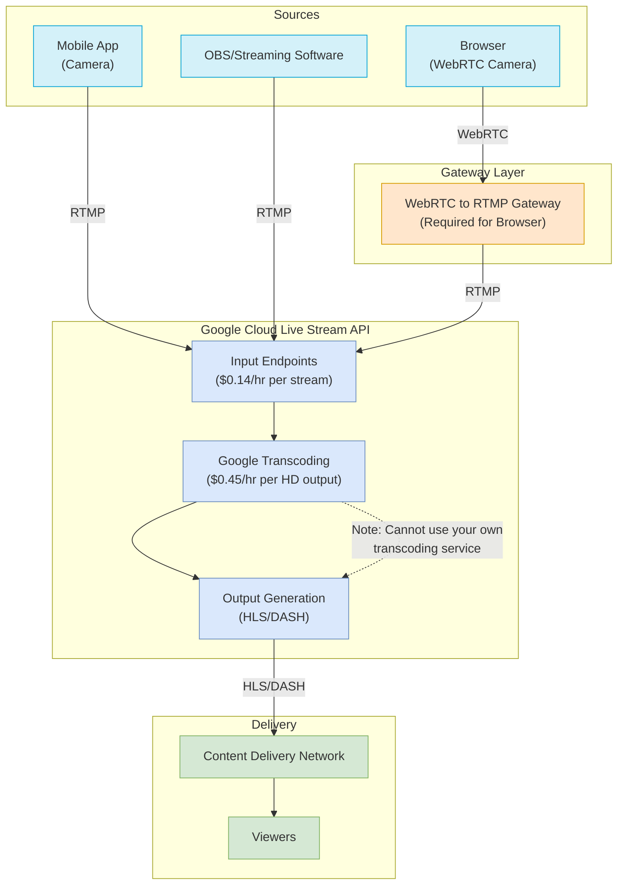
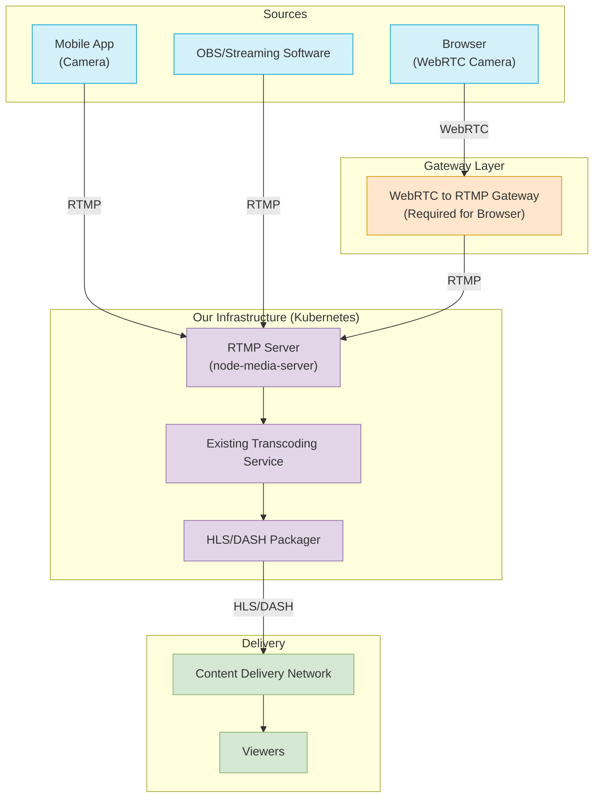

# Live Streaming Architecture Comparison

## Architecture Options with Camera Support

Below are the architectural diagrams for both Google Cloud Live Stream API and our own RTMP server solution, including camera streaming support.

### Option 1: Google Cloud Live Stream API Architecture

### Option 2: Own RTMP Server with Existing Transcoding

## Cost Comparison

### Google Cloud Live Stream API

- WebRTC Gateway: $250/month
- Google Cloud Streaming: $71,040/month
- **Total: $71,290/month**

### Own RTMP Server + Existing Transcoding

- WebRTC Gateway: $250/month
- RTMP Server + Kubernetes: $673/month
- **Total: $923/month**
- **Savings: $70,367/month (98.7%)**

## Component Details

### WebRTC to RTMP Gateway

- Required in both scenarios for browser-based camera streaming
- Converts WebRTC protocol used by browsers to RTMP protocol
- Deployed as part of Kubernetes infrastructure
- Estimated cost: $250/month

### RTMP Server (Own Solution)

- Receives RTMP streams from various sources
- Forwards to transcoding service
- Lightweight and efficient
- Part of $673/month infrastructure cost

### Transcoding Service

- In Google Cloud: Built-in, mandatory ($0.45/hr per HD output)
- In Own Solution: Using existing service (no additional cost)
- Creates multiple quality variants for adaptive streaming

## Conclusion

Both architectures support camera streaming from browsers and mobile devices. The key difference is that Google Cloud Live Stream API bundles transcoding as a mandatory service that cannot be replaced with your own, while our own RTMP solution leverages existing transcoding infrastructure.

The WebRTC to RTMP gateway is required in both scenarios for browser-based streaming. This component adds the same cost to both solutions, maintaining the significant cost advantage of our own infrastructure approach.
